# Tutoreo.pl — Design Reference Pack

Materiał referencyjny do emulacji layoutu. Wartości CSS pochodzą z `getComputedStyle()` na żywej stronie (2026-07-23).

**Źródło:** https://tutoreo.pl  
**Breakpoint główny:** `max-width: 1000px` (mobile) / `> 1000px` (desktop)  
**Surowy dump CSS:** [`layout-css.json`](./layout-css.json)  
**Screenshoty:** [`screenshots/`](./screenshots/)

---

## Spis screenshotów

### Desktop 1440×900 (oryginał)
| Plik | Opis |
|------|------|
| 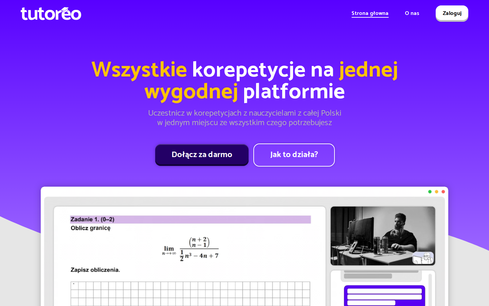 | Hero + nav |
| [desktop-00-hero-with-cookies.png](./screenshots/desktop-00-hero-with-cookies.png) | Hero z bannerem cookies |
| [desktop-full.png](./screenshots/desktop-full.png) | Cała strona |
| [desktop-navbar-top.png](./screenshots/desktop-navbar-top.png) | Nav na górze (transparent) |
| [desktop-navbar-scrolled.png](./screenshots/desktop-navbar-scrolled.png) | Nav po scrollu (biały) |
| [desktop-03-cta-section.png](./screenshots/desktop-03-cta-section.png) | Sekcja CTA |
| [desktop-04-hero-video.png](./screenshots/desktop-04-hero-video.png) | Wideo hero |
| [desktop-05-how-it-works.png](./screenshots/desktop-05-how-it-works.png) | Jak działa |
| [desktop-06-benefits.png](./screenshots/desktop-06-benefits.png) | Benefity — korepetytor |
| [desktop-06-benefits-student.png](./screenshots/desktop-06-benefits-student.png) | Benefity — uczeń |
| [desktop-07-faq.png](./screenshots/desktop-07-faq.png) | FAQ |
| [desktop-08-secondary-cta.png](./screenshots/desktop-08-secondary-cta.png) | Secondary CTA |
| [desktop-09-footer.png](./screenshots/desktop-09-footer.png) | Stopka |

### Mobile 390×844 (oryginał)
| Plik | Opis |
|------|------|
| 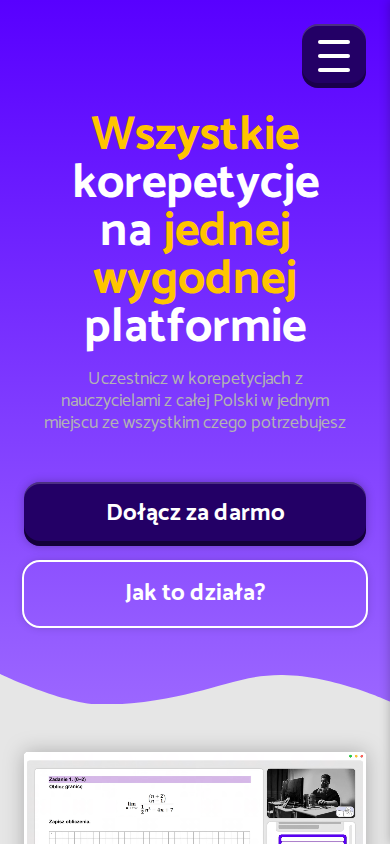 | Hero mobile |
| [mobile-00-hero-with-cookies.png](./screenshots/mobile-00-hero-with-cookies.png) | Hero + cookies |
| [mobile-full.png](./screenshots/mobile-full.png) | Cała strona |
| [mobile-mobile-menu-open.png](./screenshots/mobile-mobile-menu-open.png) | Menu hamburger |
| [mobile-05-how-it-works.png](./screenshots/mobile-05-how-it-works.png) | Jak działa |
| [mobile-06-benefits.png](./screenshots/mobile-06-benefits.png) | Benefity |
| [mobile-07-faq.png](./screenshots/mobile-07-faq.png) | FAQ |
| [mobile-09-footer.png](./screenshots/mobile-09-footer.png) | Stopka |

### Tablet 768×1024
| Plik | Opis |
|------|------|
| [tablet-full.png](./screenshots/tablet-full.png) | Cała strona |
| [tablet-01-hero.png](./screenshots/tablet-01-hero.png) | Hero |

### Clone (nasza implementacja)
| Plik | Opis |
|------|------|
| [clone-desktop-hero.png](./screenshots/clone-desktop-hero.png) | Clone hero desktop |
| [clone-desktop-full.png](./screenshots/clone-desktop-full.png) | Clone full desktop |
| [clone-mobile-hero.png](./screenshots/clone-mobile-hero.png) | Clone hero mobile |
| [clone-mobile-full.png](./screenshots/clone-mobile-full.png) | Clone full mobile |

---

## 1. Design tokens

```css
:root {
  --Spacer_Big: 48px;
  --Spacer_Medium: 24px;
  --Spacer_Small: 16px;
  --Spacer_Tiny: 4px;
  --BigButton: 64px;
  --BorderRadius1: 16px;
  --BorderRadius2: 8px;
  --FontSize1: 48px;
  --FontSize2: 18px;
  --FontSize3: 24px;

  --AccentColor: #5800FF;
  --AccentColor1: #9B66FF;
  --AccentColor2: #230066;
  --AccentHighlight: #FFC400; /* .Accent word color */
  --RegularBackground: #FFFFFF;
  --TonedBackground: #E6E6E6;
  --Dark1: #CCCCCC;
  --Dark2: #B3B3B3;
  --RegularFont: #000000;

  --AccentShadow: 0 0 16px #4600CC;
  --PopOffShadow: 0 0 10px rgba(0, 0, 0, 0.25);
  --InsetShadow: inset 0 0 8px rgba(0, 0, 0, 0.1);
  --ShinyShadow: inset 0 2px #FFFFFF30, inset 0 -5px rgba(0, 0, 0, 0.25);
  --ButtonBottomShadow: inset 0 -5px rgba(0, 0, 0, 0.25);
  --UniversalTransition: 0.2s ease-in-out;
  --NavbarHeight: calc(var(--Spacer_Big) + 2 * var(--Spacer_Small)); /* 80px */
}
```

**Font:** Catamaran, weights 100–900. Base: `18px / 18px`.

**Gradients:**
- Hero / FAQ: `linear-gradient(#5800FF, #9B66FF)`
- HowItWorks: `radial-gradient(#9B66FF, #5800FF)`
- Footer: `linear-gradient(135deg, #5800FF, #9B66FF)`

---

## 2. Breakpoint & responsywność

```css
/* Główny switch layoutu */
@media (max-width: 1000px) {
  /* Mobile / tablet wąski */
  .Desktop { display: none !important; }
  .Mobile  { display: unset !important; }
  #NavbarToggle { /* widoczny */ }
  #MainNavbar desktop-links { display: none; }
}

@media (min-width: 1001px) {
  .Desktop { display: unset !important; }
  .Mobile  { display: none !important; }
  #NavbarToggle { height: 0; /* ukryty */ }
}
```

| Element | Desktop (>1000) | Mobile (≤1000) |
|---------|-----------------|----------------|
| Nav links + Zaloguj | widoczne w rzędzie | ukryte; hamburger |
| Hero H1 | 2 linie `.Desktop` | 2 linie `.Mobile` |
| CTA buttons | `flex-direction: row` | `flex-direction: column` |
| ThreeSteps | `row`, 948px | `column`, 300px |
| HowItWorks radius | `200px 200px 0 0` | `50px 50px 0 0` |
| Benefits tabs | `row` | `column` |
| Benefits cards | 3 w rzędzie (420px) | stack 1 kolumna |
| FAQ question | grid `648px 32px` | grid `190px 32px` / width 342px |
| Footer | `flex-direction: row` | `flex-direction: column` |
| Hero video margin | `-200px 0 300px` | `0` + padding `48px 24px` |
| Sticky video top | `128px` | `64px` |

---

## 3. Global page shell

```css
html { background-color: var(--AccentColor); }

#PageBG {
  position: relative;
  z-index: 1;
  background: var(--TonedBackground); /* #E6E6E6 */
  border-radius: 0 0 50px 50px;
  box-shadow: var(--PopOffShadow);
  min-height: 100vh;
  overflow: visible;
}

footer {
  margin-top: -50px; /* nachodzi pod PageBG */
  z-index: 0;
  padding: 98px 0 48px; /* mobile: 98px 48px 48px */
  background: linear-gradient(135deg, #5800FF, #9B66FF);
}
```

---

## 4. Navbar


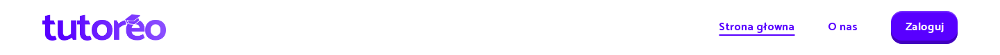

### Desktop
```css
#MainNavbar {
  position: fixed;
  top: 0; left: 0; right: 0;
  z-index: 1000;
  height: 80px;
  background: transparent;
  transition: background-color 0.2s ease-in-out;
}
#MainNavbar.LightNavbar {
  background: #fff;
  box-shadow: var(--PopOffShadow);
}

#NavbarWidthRestrainer {
  display: flex;
  flex-direction: row;
  justify-content: flex-end;
  align-items: center;
  gap: 48px;
  height: 80px;
  padding: 16px 24px;
  margin: 0 37px; /* ~1366px content */
}

#MainNavbarLogo {
  width: 178px;
  height: 38px;
  /* top: Logo_Nav_White.webp | scrolled: Logo_Nav.webp */
}

/* Linki */
#NavbarWidthRestrainer > a:not(#NavbarCTA):not(#LogoLink) {
  font-size: 18px;
  font-weight: 700;
  color: #fff; /* LightNavbar → #5800FF */
}
/* Active underline ::after */
a.active::after {
  content: "";
  position: absolute;
  left: 0; right: 0; bottom: -4px;
  height: 2px;
  background: #fff; /* LightNavbar → #5800FF */
}

#NavbarCTA {
  height: 48px;
  line-height: 48px;
  padding: 0 32px;
  border-radius: 16px;
  font-size: 18px;
  font-weight: 700;
  /* top: bg white, color black */
  /* LightNavbar: bg #5800FF, color white */
  box-shadow: var(--PopOffShadow), var(--ShinyShadow);
}
```

### Mobile
```css
#NavbarToggle {
  width: 48px;
  height: 48px;
  border-radius: 16px;
  /* widoczny tylko ≤1000px */
}
#MobileNavbar {
  /* full-screen overlay po otwarciu toggle */
}
```

---

## 5. Hero / CTA + wideo


### Sekcja CTA
```css
#CTASection {
  display: flex;
  flex-direction: column;
  align-items: center;
  position: relative;
  background: linear-gradient(#5800FF, #9B66FF);
  padding-top: 128px; /* mobile: ~96–128px pod nav */
}

#CTAText {
  display: flex;
  flex-direction: column;
  width: 903px;          /* mobile: 100% z paddingiem */
  padding-top: 48px;
  text-align: center;
}

/* Desktop H1 — 2 elementy .Desktop */
#CTAText h1.Desktop {
  display: block;        /* mobile: none */
  font-size: 64px;
  font-weight: 700;
  line-height: 64px;
  color: #fff;
  white-space: nowrap;
}
/* Mobile H1 — 2 elementy .Mobile */
#CTAText h1.Mobile {
  display: none;         /* mobile: block */
  font-size: ~40–56px;   /* clamp na wąskich */
  font-weight: 700;
  line-height: 1.05;
  color: #fff;
}
.Accent { color: #FFC400; }

#CTAText p {
  font-size: 24px;       /* mobile: ~20px */
  line-height: 28px;
  font-weight: 400;
  color: #B3B3B3;
  margin: 16px 0 48px;
}

#CTAButtons {
  display: flex;
  flex-direction: row;   /* mobile: column */
  justify-content: center;
  align-items: center;
  gap: 16px;
  padding-bottom: 48px;
  margin-bottom: 100px;  /* mobile: mniejszy */
}

/* Primary button */
#CTAButton {
  height: 64px;
  padding: 0 48px;
  border-radius: 16px;
  font-size: 24px;
  font-weight: 700;
  line-height: 64px;
  color: #fff;
  background: #230066;
  box-shadow: var(--PopOffShadow), var(--ShinyShadow);
  white-space: nowrap;
}
#CTAButton:active {
  filter: brightness(0.8);
  box-shadow: none;
  transform: translateY(2px);
}

/* Soft / ghost button */
#SoftCTAButton {
  height: 64px;
  padding: 0 48px;
  border-radius: 16px;
  font-size: 24px;
  font-weight: 700;
  line-height: 64px;
  color: #fff;
  background: transparent;
  outline: 2px solid #fff;
  box-shadow: var(--PopOffShadow);
}
```

### Wave pod hero
```css
/* Asset: /Waves/LandingPage/Wave1.svg — fill #E6E6E6 */
#CTASection .GradientWaveCutout {
  display: block;
  width: 100%;
  height: auto;
  /* odcina fiolet → szare tło PageBG */
}
```

### Sticky wideo (SIBLING po `#CTASection`, NIE wewnątrz)
```css
#CTAImageDiv {
  display: flex;
  justify-content: center;
  position: sticky;
  top: 128px;                 /* mobile: 64px */
  margin: -200px 0 300px;     /* mobile: 0 */
  padding: 0 48px 48px;       /* mobile: 48px 24px */
  width: 100%;
  /* z-index: auto — kolejne sekcje malują SIĘ NAD wideo (kolejność DOM) */
}

#HeroVideo {
  display: block;
  width: 1200px;              /* mobile: 100% / ~342px */
  max-width: 100%;
  height: auto;
  object-fit: contain;
  /* src: /Graphics/HeroVideo.webm — autoplay muted loop playsinline */
}
```

**Ułożenie obrazów/wideo:**
1. Wave1.svg na dole `#CTASection` (full-bleed, fill szary).
2. Video sticky wycentrowane, max 1200px, nachodzi w dół na szare tło i pod zaokrąglony top HowItWorks.
3. HowItWorks (później w DOM, `position: relative`, nieprzezroczyste tło) przykrywa wideo przy scrollu.

---

## 6. How it works

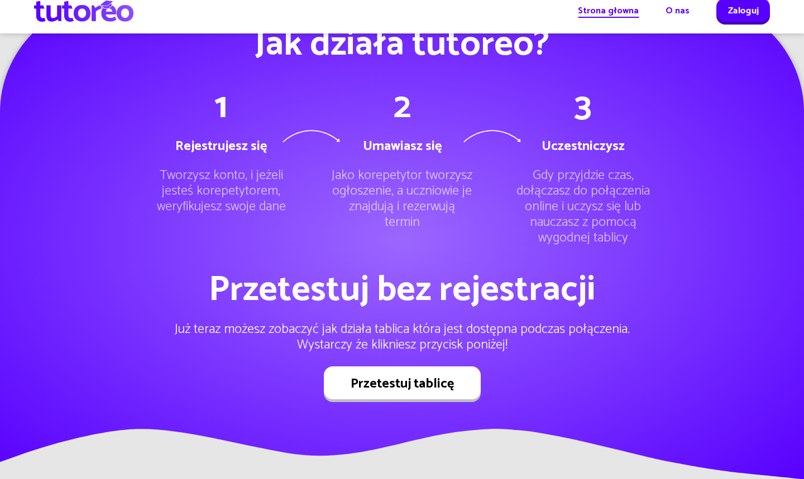
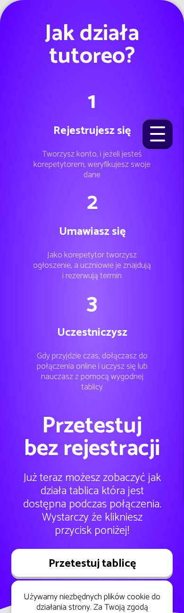

```css
#HowItWorks {
  display: flex;
  flex-direction: column;
  align-items: center;
  position: relative;
  text-align: center;
  background: radial-gradient(#9B66FF, #5800FF);
  border-radius: 200px 200px 0 0; /* mobile: 50px 50px 0 0 */
  box-shadow: var(--PopOffShadow);
}

#HowItWorks > h1 {
  font-size: 64px;
  font-weight: 700;
  line-height: 64px;
  color: #fff;
}

#ThreeSteps {
  display: flex;
  flex-direction: row;   /* mobile: column */
  gap: 24px;
  width: 948px;          /* mobile: 300px */
  margin: 48px 0;
}

.Step {
  position: relative;
  width: 300px;
  padding: 0 24px;
  text-align: center;
}
.Step > h1 {
  font-size: 64px;
  font-weight: 700;
  line-height: 64px;
  color: #fff;
}
.Step > h3 {
  margin: 24px 0;
  font-size: 24px;
  font-weight: 700;
  line-height: 28px;
  color: #fff;
}
.Step > p {
  font-size: 24px;
  font-weight: 300;
  line-height: 28px;
  color: #fff;
}

/* Strzałki między krokami — TYLKO desktop */
.Step .CurvedArrow {
  position: absolute;
  top: 64px;
  right: -72px;
  width: 120px;
  height: auto;
  /* src: /Graphics/CurvedArrow.svg */
  /* ukryte na mobile */
}

#TestWhiteboardButton {
  /* Standard white button */
  background: #fff;
  color: #000;
  height: 64px;
  padding: 0 48px;
  border-radius: 16px;
  font-size: 24px;
  font-weight: 700;
  box-shadow: var(--PopOffShadow), var(--ShinyShadow);
}

/* Wave3.svg na dole — fill #E6E6E6 */
```

---

## 7. Benefits

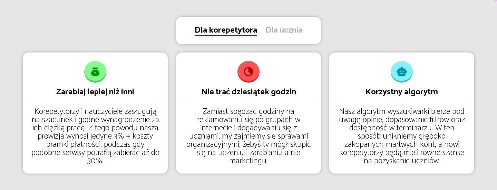
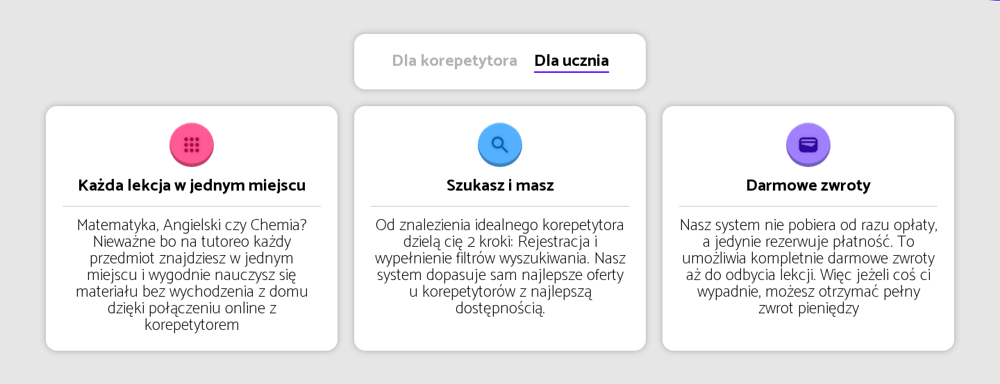
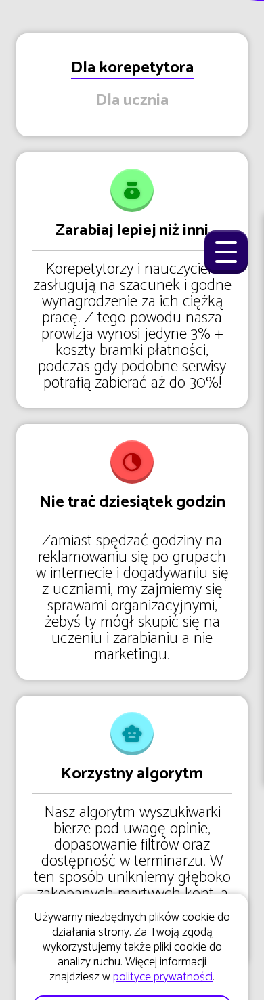

```css
#BenefitsSection {
  display: flex;
  flex-direction: column;
  align-items: center;
  position: relative;
  overflow: hidden;
  background: #E6E6E6;
  padding: 48px 24px;
}

#BenefitsCategories {
  display: flex;
  flex-direction: row;     /* mobile: column */
  justify-content: center;
  align-items: center;
  gap: 24px;
  padding: 16px 48px;
  background: #fff;
  border-radius: 16px;
  box-shadow: var(--PopOffShadow);
  white-space: nowrap;
}

#BenefitsCategories > * {
  position: relative;
  font-size: 24px;
  font-weight: 700;
  cursor: pointer;
  color: #B3B3B3;          /* .Active → #000 */
  transition: color 0.2s ease-in-out;
}
#BenefitsCategories > .Active::after {
  content: "";
  position: absolute;
  left: 0; right: 0;
  bottom: -4px;
  height: 2px;
  background: #5800FF;
}

.Benefits {
  display: flex;
  flex-direction: row;     /* mobile: column / stack */
  gap: 24px;
  margin-top: 24px;
  width: 100%;
  max-width: 1392px;
}
/* Nieaktywny zestaw: position absolute / bez cienia kart */

/* Karta informative-block */
informative-block,
.BenefitCard {
  display: flex;
  flex-direction: column;
  align-items: center;
  gap: 16px;
  width: 420px;            /* mobile: ~100% / 342–390px */
  padding: 24px;
  background: #fff;
  border-radius: 16px;
  box-shadow: var(--PopOffShadow);
  transition: box-shadow 0.2s ease-in-out;
}
.Icon {
  width: 64px;
  height: 64px;
  border-radius: 50%;
  display: flex;
  justify-content: center;
  align-items: center;
  box-shadow: var(--ShinyShadow);
}
.Icon img {
  width: 32px;
  height: 32px;
  filter: drop-shadow(0 0 2px rgba(0,0,0,0.25));
}
informative-block h2 {
  font-size: 24px;
  font-weight: 700;
  line-height: 24px;
  text-align: center;
  color: #000;
}
informative-block hr {
  width: 100%;
  height: 1px;
  border: 0;
  background: #C5C5C5;
}
informative-block p {
  font-size: 24px;
  font-weight: 100;
  line-height: 24px;
  text-align: center;
  color: #000;
}
```

### Kolory ikon kart
| Audience | Title | Icon | BG |
|----------|-------|------|-----|
| Tutor | Zarabiaj lepiej niż inni | `/icons/LandingPage/Money.svg` | `#80FF8A` |
| Tutor | Nie trać dziesiątek godzin | `/icons/LandingPage/Clock.svg` | `#FF5353` |
| Tutor | Korzystny algorytm | `/icons/LandingPage/Robot.svg` | `#80F3FF` |
| Student | Każda lekcja w jednym miejscu | `/icons/LandingPage/Apps.svg` | `#FF5996` |
| Student | Szukasz i masz | `/icons/LandingPage/Search.svg` | `#53B1FF` |
| Student | Darmowe zwroty | `/icons/LandingPage/Wallet.svg` | `#A080FF` |

---

## 8. FAQ

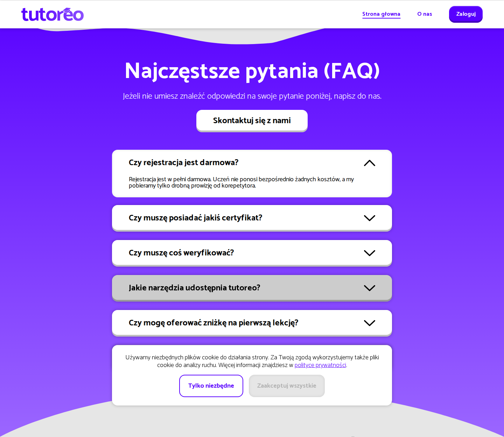
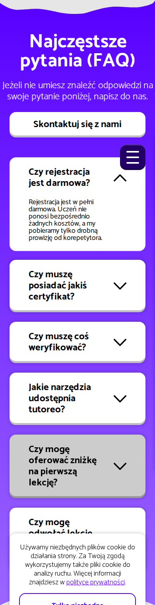

```css
#FAQSection {
  display: flex;
  flex-direction: column;
  align-items: center;
  position: relative;
  background: linear-gradient(#5800FF, #9B66FF);
}
/* Wave4.svg TOP — fill #E6E6E6 (granica z benefity) */
/* Wave5.svg BOTTOM — fill #E6E6E6 (granica z secondary CTA) */

.Question {
  display: grid;
  grid-template-columns: 648px 32px; /* mobile: 190px 32px */
  column-gap: 24px;
  width: 800px;                      /* mobile: 342px */
  padding: 24px 48px;
  margin-bottom: 24px;
  background: #fff;
  border-radius: 16px;
  box-shadow: var(--InsetShadow);
  cursor: pointer;
  text-align: left;
  transition: 0.2s ease-in-out;
}
.Question.Active {
  transform: translateY(2px);
  /* grid-template-rows rośnie o wiersz odpowiedzi */
}
.Question h3 {
  font-size: 24px;
  font-weight: 700;
  line-height: 28px;
  color: #000;
}
.Question img { /* SelectArrow.svg */
  width: 32px;
  height: auto;
  align-self: center;
  transition: transform 0.2s ease-in-out;
}
.Question.Active img {
  transform: scale(-1); /* obrót 180° */
}
.Question p {
  /* odpowiedź — max-height/opacity transition 0.2s */
  font-size: 18px;
  line-height: 18px;
  color: #000;
  overflow: hidden;
  transition: max-height 0.2s, margin-top 0.2s, opacity 0.2s;
}
.Question:not(.Active) p {
  max-height: 0;
  opacity: 0;
  margin-top: 0;
}
```

---

## 9. Secondary CTA + Footer

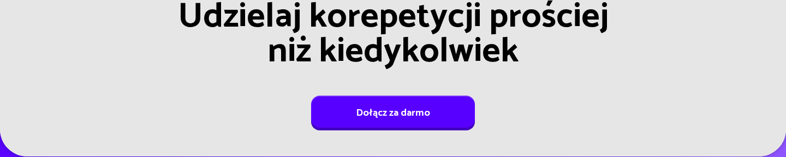
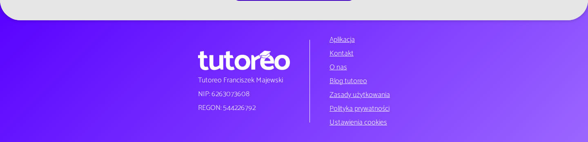

```css
#SecondaryCTA {
  display: flex;
  flex-direction: column;
  align-items: center;
  background: #E6E6E6;
  padding: 0 48px 48px;
  border-radius: 0 0 50px 50px;
}
#SecondaryCTA h1 {
  font-size: 64px;         /* mobile: clamp ~32–48px */
  font-weight: 700;
  line-height: 64px;
  text-align: center;
  color: #000;
  white-space: nowrap;     /* mobile: może wrapować */
}
#SecondaryCTA a.Standard {
  margin-top: 32px;
  background: #5800FF;
  color: #fff;
  height: 64px;
  padding: 0 48px;
  border-radius: 16px;
  font-size: 24px;
  font-weight: 700;
  box-shadow: var(--PopOffShadow), var(--ShinyShadow);
}

footer {
  display: flex;
  flex-direction: row;     /* mobile: column */
  justify-content: center;
  align-items: center;     /* desktop start/center; mobile center */
  gap: 48px;
  padding: 98px 0 48px;    /* mobile: 98px 48px 48px */
  margin-top: -50px;
  background: linear-gradient(135deg, #5800FF, #9B66FF);
}
#FooterLogo img {
  height: 48px;
  width: auto;
  /* Logo_Nav_White.webp */
}
```

---

## 10. Cookies banner

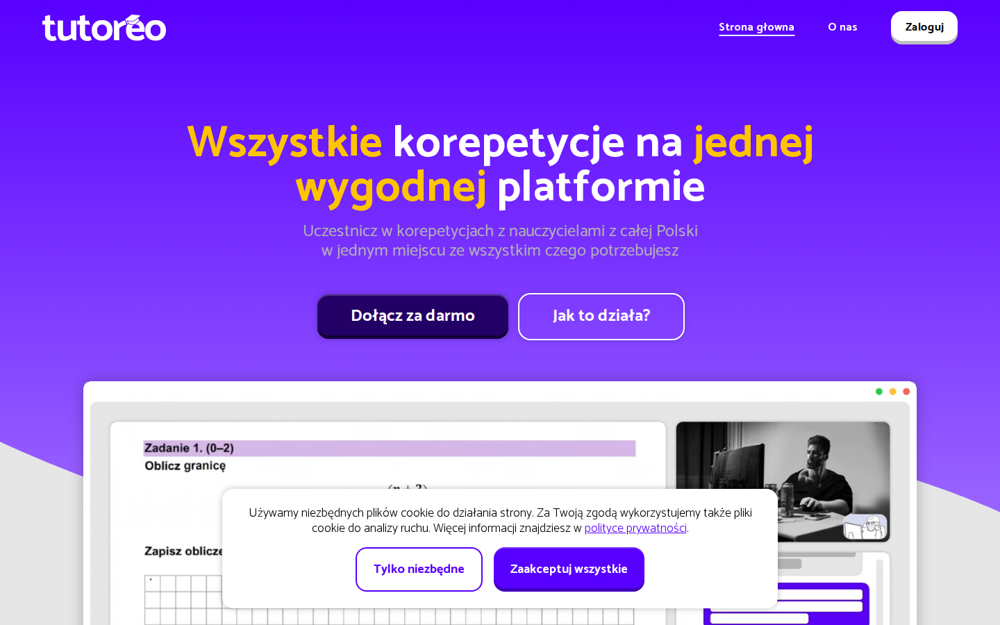

```css
cookies-banner {
  position: fixed;
  z-index: 1100;
  /* desktop: bottom-right card; mobile: bottom full-ish width */
  background: #fff;
  border-radius: 16px;
  padding: 24px;
  box-shadow: var(--PopOffShadow);
  max-width: 720px;
}
#CookiesBannerButtons {
  display: flex;
  flex-direction: row; /* mobile: column */
  gap: 12–16px;
}
```

---

## 11. Mapa assetów (ścieżki lokalne w klonie)

| Asset | Rola | Layout notes |
|-------|------|--------------|
| `/images/Logo_Nav_White.webp` | Nav top + footer | 178×38 nav; ~200×48 footer |
| `/images/Logo_Nav.webp` | Nav scrolled | 178×38 |
| `/videos/HeroVideo.webm` | Sticky hero preview | max-w 1200, object-fit contain |
| `/images/Waves/LandingPage/Wave1.svg` | Hero → gray cut | full width, fill #E6E6E6 |
| `/images/Waves/LandingPage/Wave3.svg` | HowItWorks → gray | full width |
| `/images/Waves/LandingPage/Wave4.svg` | Gray → FAQ | top of FAQ |
| `/images/Waves/LandingPage/Wave5.svg` | FAQ → gray CTA | bottom of FAQ |
| `/images/Graphics/CurvedArrow.svg` | Między krokami 1→2, 2→3 | absolute, desktop only, 120px |
| `/images/icons/LandingPage/*.svg` | Ikony benefitów | 32×32 w kółku 64×64 |
| `/images/icons/SelectArrow.svg` | FAQ chevron | 32px, rotate when open |

---

## 12. Kolejność warstw (z-index / paint)

1. `footer` — z-index 0, pod PageBG (margin-top −50px)
2. `#PageBG` — z-index 1
3. `#CTAImageDiv` sticky video — z-index **auto** (nie podnosić!)
4. Sekcje po wideo w DOM (`#HowItWorks`, `#BenefitsSection`, `#FAQSection`…) — `position: relative` + nieprzezroczyste tło → malują **nad** sticky video
5. `#MainNavbar` — z-index 1000
6. Cookies banner — z-index 1100

> **Błąd do uniknięcia:** nadanie `z-index > 0` sticky wideo sprawia, że nachodzi na Benefity/FAQ.

---

## 13. Interakcje (skrót)

| Element | Model | Szczegóły |
|---------|-------|-----------|
| Navbar | scroll | `scrollY > ~40` → `.LightNavbar` |
| Benefits tabs | click | tutor ↔ student, underline Active |
| FAQ | click accordion | jeden otwarty; arrow rotate; max-height 0.2s |
| Buttons | :active | brightness 0.8 + translateY(2px) + shadow off |
| Hero video | sticky | top 128/64; DOM order covers later |

---

## 14. Galeria — pełne strony

### Oryginał desktop
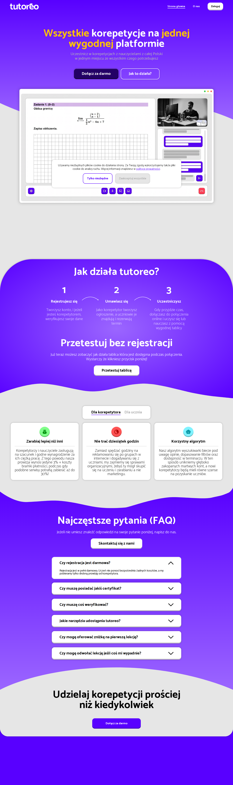

### Oryginał mobile
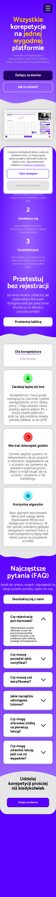

### Clone desktop
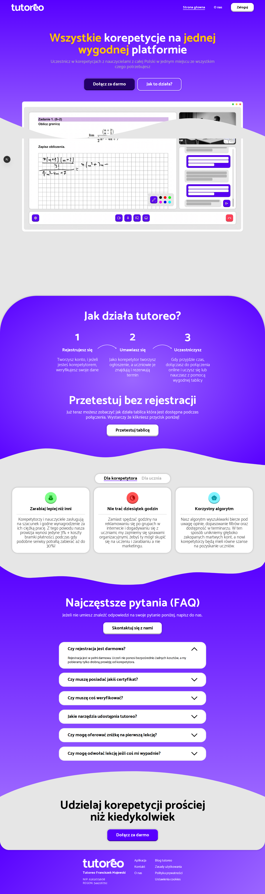

### Clone mobile
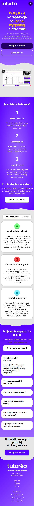

---

*Wygenerowano skryptem `scripts/build-design-reference.mjs`. Po zmianach na żywej stronie uruchom ponownie, by odświeżyć `layout-css.json` i screenshoty.*
